# Arquitectura del módulo de prospección granel

Estado: **interfaz demostrativa**. La detección, clasificación, deduplicación y
scoring están implementadas y probadas. La asignación y el pipeline viven en
memoria del navegador. No hay backend, ni base de datos, ni autenticación.

---

## 1. Fuentes de datos

| Fuente | Rol | Estado |
|---|---|---|
| OpenStreetMap vía Overpass API | Detección de empresas | Implementada |
| Nominatim | Geocodificación de localidades | Implementada (modo en vivo) |
| Leaflet + teselas de OSM | Mapa | Implementado |
| Google Maps | Enlace externo por prospecto | Implementado |
| Google Places | Detección futura | Declarado, deshabilitado |

### Aclaración obligatoria sobre los mirrors

`maps.mail.ru/osm/tools/overpass/api/interpreter` **es un mirror de Overpass**,
no una segunda base de datos. Sirve exactamente los mismos datos de
OpenStreetMap que `overpass-api.de`, bajo la misma licencia ODbL. Los tres
endpoints listados en `OVERPASS_ENDPOINTS` son intercambiables y existen sólo
por disponibilidad: si uno devuelve 429 o 504 se reintenta con el siguiente y el
resultado es equivalente.

Presentarlo en una demo como "una segunda fuente de datos" sería incorrecto y
sobrevendería la cobertura real del sistema. La cobertura es la de OSM, una vez.

---

## 2. Contrato de proveedores

Un proveedor sólo sabe **encontrar empresas reales y devolverlas sin interpretar**.
No clasifica, no puntúa y no conoce el negocio de GLP.

```ts
type ProspectProvider = {
  id: string
  label: string
  attribution: string                        // obligatoria: se muestra en la ficha
  availability(): ProviderAvailability       // ready | unavailable + motivo
  discover(request: DiscoveryRequest): Promise<readonly RawElement[]>
}
```

Implementaciones actuales:

| Proveedor | Id | Estado |
|---|---|---|
| `DemoOsmProvider` | `openstreetmap-demo` | Reproduce la captura real; es el que usa la demo |
| `OpenStreetMapProvider` | `openstreetmap` | Consulta en vivo con failover entre mirrors |
| `GooglePlacesProvider` | `googleplaces` | Declarado, `availability() = unavailable` |

Agregar una fuente oficial es implementar la interfaz y sumarla a
`providers/index.ts`. Ni la clasificación, ni el scoring, ni la interfaz cambian.

### Por qué Google Places está deshabilitado

Una API key de Places en el frontend queda expuesta a cualquiera que abra el
inspector del navegador, y su facturación es por consulta. La integración real
tiene que salir del backend, firmando la petición del lado del servidor y con
cuota por usuario. Hasta que ese backend exista, el proveedor declara
`unavailable` con el motivo visible en lugar de fingir que funciona.

---

## 3. Flujo

```mermaid
flowchart LR
  A[Detección] --> B[Clasificación GLP]
  B --> C[Deduplicación]
  C --> D[Scoring]
  D --> E[Asignación]
  E --> F[Pipeline]
  F --> G[Cotización]
  G --> H[Seguimiento]

  style A fill:#d6f0e0,stroke:#0a6b33
  style B fill:#d6f0e0,stroke:#0a6b33
  style C fill:#d6f0e0,stroke:#0a6b33
  style D fill:#d6f0e0,stroke:#0a6b33
  style E fill:#fff3d6,stroke:#a8730a
  style F fill:#fff3d6,stroke:#a8730a
  style G fill:#fff3d6,stroke:#a8730a
  style H fill:#f2f2f2,stroke:#999
```



- **Verde — determinista e implementado.** Vive en `src/prospecting/`, sin estado
  ni red, y está cubierto por pruebas. Mismo insumo, mismo resultado.
- **Ámbar — sólo interfaz.** Existe en pantalla y se pierde al recargar.
- **Gris — no implementado.** Requiere persistencia.

| Etapa | Módulo | Estado |
|---|---|---|
| Detección | `providers/` | Implementada |
| Clasificación GLP | `classify.ts` | Implementada |
| Deduplicación | `dedup.ts` | Implementada |
| Scoring | `score.ts` | Implementado |
| Asignación | estado de React | En memoria |
| Pipeline | estado de React | En memoria |
| Cotización | `App.tsx` + `categoryMapping.ts` | Implementada sin persistir |
| Seguimiento | — | No implementado |

---

## 4. Clasificación GLP

Determinista y explicable, sin modelo estadístico. Los mismos selectores OSM
construyen la consulta Overpass **y** clasifican el resultado, así no pueden
divergir.

Criterio de decisión, en orden:

1. **Selector específico** (`shop=bakery`, `industrial=slaughterhouse`,
   `tourism=hotel`): evidencia fuerte del rubro.
2. **Palabra clave** en nombre, operador, descripción o producto — normalizada
   sin acentos, porque OSM viene acentuado y las claves no.
3. **Fallback genérico**: si sólo hay etiquetas amplias (`landuse=industrial`,
   `man_made=works`), se ubica en el rubro contenedor — *Industria pesada* o
   *Agro* — en lugar de adivinar una especialidad.
4. **Descarte**: sin ninguna señal, el registro se descarta. Precisión sobre
   cobertura: es preferible una lista corta y correcta a una larga con ruido.

Sólo se consideran los rubros que el usuario seleccionó.

---

## 5. Scoring de potencial GLP

```
total = fit térmico + escala de instalación + continuidad operativa − señales negativas
```

| Componente | Rango | Qué mide |
|---|---|---|
| Fit térmico | 0–45 | Uso térmico real del rubro (secado y calderas arriba, gastronomía abajo) |
| Escala | 0–25 | Indicios de instalación de porte: parcela industrial, nave, silo, operador |
| Continuidad | 0–15 | Si el consumo se sostiene: hotelería todo el año, horno diario, marcha continua |
| Señales negativas | negativo | Local chico sin edificio, alojamiento reducido, cocina de bajo caudal |

Prioridad: **ALTA** ≥ 65, **MEDIA** ≥ 42, **BAJA** por debajo.

Cada punto lleva un motivo legible, y la interfaz muestra el desglose completo:
el usuario ve *por qué* puntúa lo que puntúa en lugar de confiar en un número.

**La calidad del dato se calcula aparte** (`dataConfidence`, 0–100: teléfono,
web, dirección, operador). Una empresa con alto consumo y ficha pobre en OSM
sigue siendo un buen prospecto — sólo cuesta más contactarla. Mezclar ambas
cosas en un único número penalizaría a las mejores oportunidades por un defecto
del dato público, no del negocio.

Este scoring es **específico de GLP**. No hereda nada del scoring de camiones del
proyecto de referencia.

### Del prospecto a la cotización

"Cotizar" arma **siempre una cotización nueva** desde `initial()`. Partir de la
que está en pantalla arrastraría el CUIT, el email, los materiales, el tanque y
las condiciones editadas del cliente anterior al prospecto siguiente, sin que
nadie lo note.

Se precarga sólo lo que el prospecto publica —nombre, y teléfono, dirección y
localidad si existen—; lo demás queda vacío.

La **categoría comercial** no es el rubro: `categoryMapping.ts` traduce los 13
rubros de prospección a los 3 segmentos que usa el cotizador.

| Segmento | Rubros |
|---|---|
| `industrial` | secaderos, industria alimenticia, asfalto, calderas, hornos, industria pesada |
| `agro` | agro, tambos, avícola/porcino, invernaderos |
| `comercial` | gastronomía/panadería, hotelería, lavaderos |

`residencial` existe en el catálogo del cotizador pero ningún rubro lo produce:
la prospección granel busca consumo productivo, no viviendas.

El rubro exacto no se pierde en esa reducción: viaja en
`installation.sourceIndustry` y se muestra como campo de sólo lectura.

---

## 6. Interfaz

Diseñada primero para 375 px.

**Móvil.** Navegación de dos módulos de 52 px separados por 12 px; controles de
búsqueda (localidad, rubros, filtros) de 48 px que abren hojas inferiores; mapa
protagonista con altura explícita; panel de resultados montado sobre el borde
inferior del mapa, con filas planas —icono de rubro, nombre, sector, distancia,
score y nivel— y las acciones "Cotizar" y "Ver perfil".

**Escritorio (≥1024 px).** Mapa al ~62% y panel de resultados al ~38%, lado a
lado; las hojas pasan a panel desplegable centrado; la barra superior colapsa a
una sola fila.

**Ficha del prospecto.** Se abre desde "Ver perfil" y concentra el desglose del
score, el contacto, el origen del dato y las acciones comerciales. WhatsApp vive
acá —no en cada fila— y sólo aparece si la empresa publica un teléfono.

**Iconografía.** Phosphor Icons, con un `Record<IndustryKey, Icon>` que obliga a
cubrir los 13 rubros. El mismo icono se usa en filtros, marcadores, filas y ficha.

**Marcadores.** `divIcon` con score y rubro, agrupados por grilla de píxeles al
zoom actual. Leaflet recalcula su tamaño tras el montaje, ante cualquier cambio
de tamaño observado y al terminar de cargar las teselas: sin eso el mapa queda
en blanco.

**Accesibilidad.** Objetivos táctiles de 44 px o más, campos de 16 px para que
iOS no haga zoom al enfocarlos, foco visible, hojas modales con contención de
foco y cierre con Escape, y nivel de potencial comunicado con texto y barras
además de color.

**Enlaces externos.** El sitio web viene de OpenStreetMap, que edita cualquiera:
`url.ts` sólo admite `http` y `https`, y descarta el resto.

---

## 7. Datos de la demo

`src/prospecting/demo/osm-canuelas-2026-08-15.demo.json` — 387 empresas reales de
OpenStreetMap capturadas el 2026-08-15 en un radio de 35 km alrededor de
Cañuelas. Se versiona junto a la consulta Overpass que la produjo
(`.overpass.ql`) para que cualquiera pueda reproducirla.

**Ningún registro es inventado.** Las empresas sin teléfono o dirección se
muestran incompletas; no se rellenan con estimaciones. Si un rubro no tiene
empresas mapeadas en el radio, el listado aparece vacío con la explicación
correspondiente en vez de completarse con datos sintéticos.

Ver `src/prospecting/demo/README.md` para la procedencia detallada.

---

## 8. Arquitectura futura

### Fase A — Backend de prospección

- Mover Overpass y Nominatim al servidor: caché por (localidad, radio, rubros),
  respeto de las políticas de uso y un único User-Agent identificable, en lugar
  de que cada navegador consulte por su cuenta.
- Persistir prospectos con su `externalId` de origen, para poder reconciliar
  contra capturas posteriores sin duplicar.
- Registrar cada corrida (criterios, cantidad de resultados, versión del scoring)
  para poder explicar por qué una lista cambió entre dos fechas.

### Fase B — Estado comercial

- Asignación y pipeline persistidos, con responsable, próxima acción y fecha.
- Historial de contactos por prospecto.
- Vínculo `prospecto → cotización` bidireccional y trazable.
- Deduplicación contra la cartera existente: un prospecto que ya es cliente debe
  aparecer marcado, no como oportunidad nueva.

### Fase C — Proveedores adicionales

- `GooglePlacesProvider` real, con credencial en el backend y cuota por usuario.
- Padrones oficiales y cámaras sectoriales, que aportan rubro declarado y
  domicilio fiscal — mejor señal que las etiquetas de OSM.
- Enriquecimiento por sitio web de la empresa.

Al sumar varias fuentes, la deduplicación deja de ser por nombre y proximidad y
pasa a necesitar identidad fiscal (CUIT) como clave.

### Fase D — Seguimiento

- Estados de oportunidad, embudo y métricas de conversión por rubro y territorio.
- Recalcular el score cuando cambia el dato de origen, conservando el histórico
  para no perder la explicación de decisiones pasadas.

---

## 9. Límites conocidos

- **La cobertura es la de OpenStreetMap.** En zonas rurales muchas empresas no
  están mapeadas, y las que están suelen no publicar teléfono. Es un piso de
  prospección, no un padrón.
- **Sin CUIT no hay identidad fuerte.** La deduplicación actual usa nombre
  normalizado más proximidad; alcanza para el nodo y el polígono de la misma
  empresa, no para dos sucursales con el mismo nombre.
- **El fallback genérico es amplio.** Una parcela `landuse=industrial` sin más
  señal cae en *Industria pesada*; puede ser cualquier cosa, incluida una
  terminal de colectivos. El score la ordenará, pero conviene revisarla.
- **El consumo actual de gas es desconocido.** OSM no informa si la empresa ya
  tiene gas natural por red, que es el principal descalificador comercial. Eso
  hoy sólo se resuelve en la visita.
